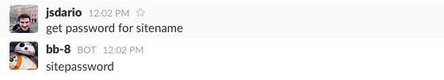
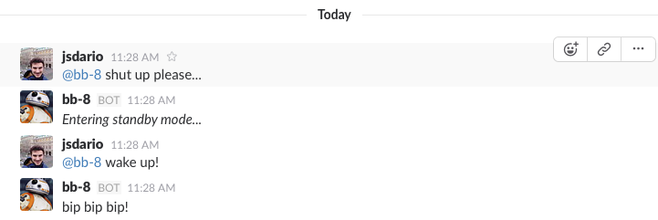

# passbot
:package: Slack robot password manager

> passbot is in a really early stage and all aspects of this documentation are not yet implemented. Those must serve as roadmap.

Passbot will take your bot name and avatar. It will respond to mentions or direct messages, but will only share passwords to a set
of authorised users.



It gets funny and makes some comments about your team or reacts before certain words. If it gets annoying just tell it to shut up:



<a name="get-started"></a>
## Get started
```
git clone https://github.com/netbeast/passbot && cd passbot
npm install
npm start -- --token <SLACK BOT INTEGRATION TOKEN>
```

If token is not present it will look for a environment variable in `process.env.PASSBOT_TOKEN`.
If you do not have such integration token ready you can get one [here](https://netbeast.slack.com/apps/new/A0F7YS25R-bots).

It will read passwords from **.passwords.json** on project folder, which is gitignored. If no passwords are found
a error sound like `mec mec mec` will be its answer. You can create it telling passbot to save its first pass.

It will react before certain expressions even if not mentioned. Those can be added directly chatting with passbot
through slack, like before, or manually on **.expressions.json** file, also on project folder.

## Contribute
If you have nodemon installed you can start development mode as:
```
npm run dev
```

### tasks
You can ask the bot to perform tasks. By default no tasks are installed. Tasks are javascript (or babel ES6/7) single-file programs
installed under **./tasks** folder. To ask the bot to execute a task tell him:

```@bb-8 please <name of file without js> ...arguments you want to pass it```
